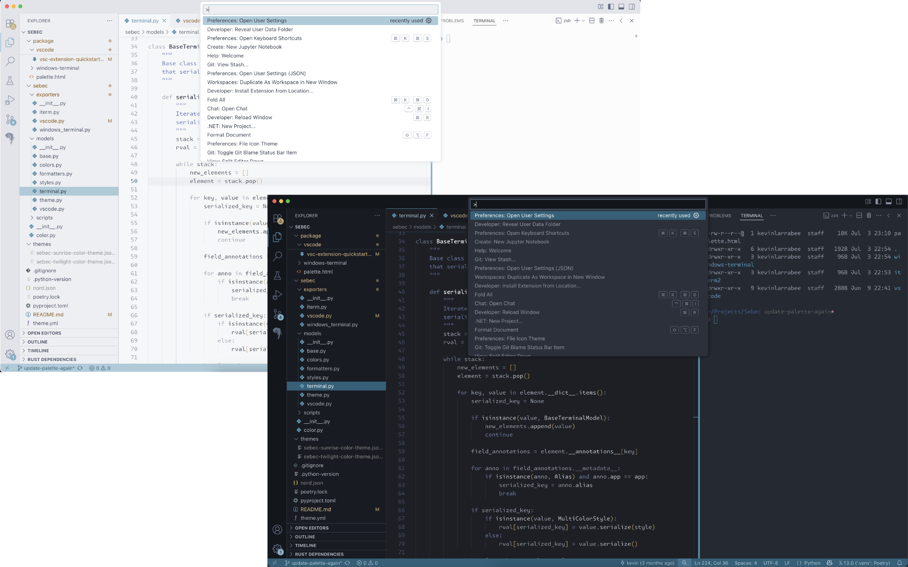

# Sebec Theme

Sebec is a dual-mode color theme originally inspired by [Nord](https://www.nordtheme.com/) and [Verdandi](https://github.com/be5invis/vsc-theme-verdandi). Application support currently includes:

- iTerm2
- VS Code
- Windows Terminal

**Important:** This theme is a work in progress, and language
support in VS Code is still very preliminary.

## Motivation

Most color themes have become too distracting for me, and it's been incredibly
hard to find a light theme that helps me distinguish between tokens and UI elements
while still also being readable at a glance in bright light, so this theme is my
attempt to balance colorization, "gray"-scale variations, and a wider spectrum
of background elements such that:

* Token colors are no longer so different that they are visually jarring and distracting
* Background colors for panels & widgets naturally attract attention to the element
that should have focus
* Iteration and maintenance should be easy, ie. using named colors and generators
rather than manually editing application-specific theme files and hex color values

## Development

Run `poetry install` to add the necessary scripts.

The various theme files are generated via `poetry run generate`,
which will update their files stored in `package/`.

After updating the Affinity Designer palette, re-export the `palette.svg` file
from the artboard and then run `poetry run update-colors` to update the `Color` enum itself.

### Testing the VS Code theme

Open `package/vscode` in a **new** VS Code instance, after which selecting the `launch.json`
file and pressing `F5` will open another instance with the theme activated.
