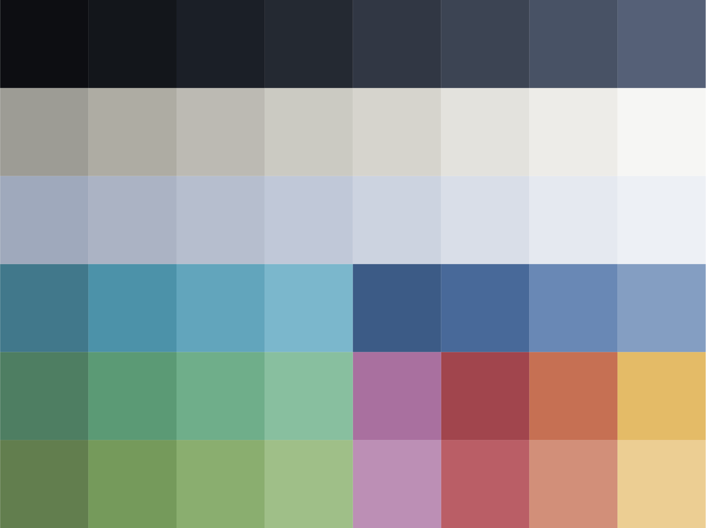

# Sebec Theme

Sebec is a combined light & dark color theme heavily inspired by (and derived from) [Nord](https://www.nordtheme.com/),
with an extended palette that enables a *pleasant light theme* as well as *greater variations in background colors*
for UI elements to enable easier visual separation of panels & widgets and improving focus on 'top' elements.

## Background

**Goals**

- Provide a light theme that is consistent with the dark theme and easy to read

- Like Nord, avoid the "rainbow explosion" that some of us find distracting and sometimes even exhausting

- Improve visual separation of UI elements like panels, editors, widget, minimap, etc

    - Avoid a 'flat wash' of background colors or reliance on borders

    - Naturally pull attention to the element that is meant to be focused on

- **Theme-as-code**: Using named colors and generative utilities to enable faster editing,
significantly easier maintenance, and greater consistency across application themes

## Palette

The palette consists of:

- Three 8-color **primary ranges** to enable a greater hierarchy in foreground & background colors

- Four 4-color **accent ranges** (warm & cool greens & blues) that blend well with the 8-color ranges
for visual distinction without significant contrast

- Four 2-color **accent ranges** that visually pop against the others for increased attention grabbing

### Style Guide

#### Sunrise Theme

##### Styles

TODO

bold
italic
underline
strikethrough

##### Colors

**Twilight:**
- Foreground colors

**Sunrise:**
- Background colors for UI elements

#### Twilight Theme

**Twilight:**
- Background colors for UI elements
- Editor tokens that should recede into the background to reduce visual clutter

**Sunrise:**
- Foreground colors in UI, editor, and terminal

**Sapphire:**
- Editor tokens that should be readable without attracting focus

**Cerulean:**
- Editor tokens that should have visual prominence

**SolarPurple:**
- Editor tokens that should be distinct from language constructs, classes, and methods, eg:
    - Literal values, eg. strings and booleans
    - Constant variables
    - Enum members

## Development

Run `poetry install` to add the necessary scripts.

The VS Code and iTerm2 themes are generated via `poetry run generate`,
which will update their files stored in `package/`.

After updating the palette (Affinity Designer), re-export the `palette.svg` file
from the artboard and then run `poetry run update-colors` to update the `Color` enum itself.

### Testing the VS Code theme

Open `package/vscode` in a **new** VS Code instance, after which selecting the `launch.json`
file and pressing `F5` will open another instance with the theme activated.
