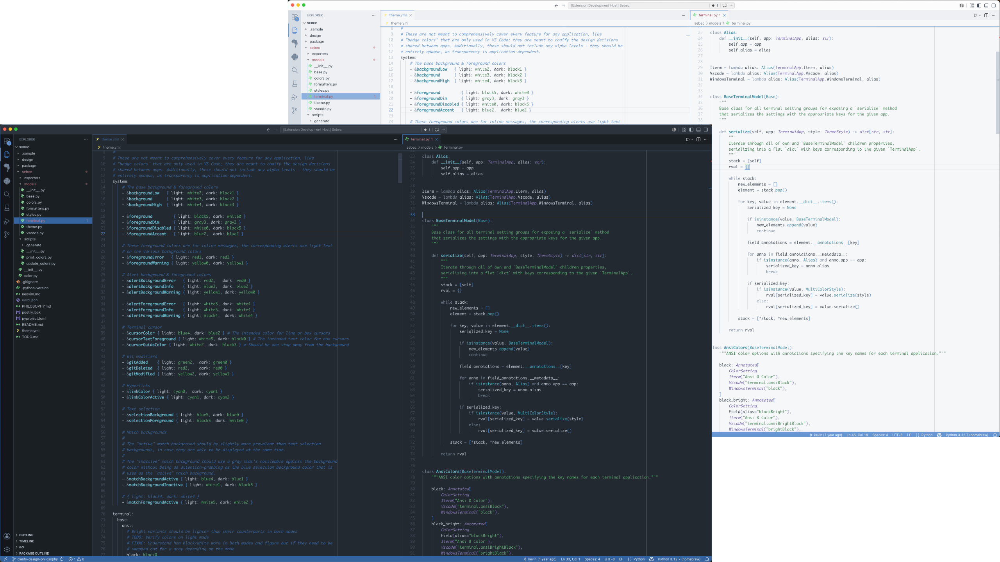

# Sebec Theme

Application support currently includes:

- **Editors:** VS Code
- **Terminals:** iTerm2, Windows Terminal

## Motivation

This theme exists solely due to my struggle to find light and dark themes (which I do switch between
depending on the environment I'm in) that help more than they hurt; or in other words,
that aid in visual processing more than they distract, and that have consistency in styling
between light and dark modes so that switching between isn't jarring and doesn't require 'retraining'.

I also wanted consistency between applications, too, since I do switch between editors for various reasons.

## Philosophy

Sebec uses a smaller palette of colors than many other themes.
Rather than attempting to apply a unique colors or styles to as many token categories
as possible, only a few colors are used to meaningfully distinguish between the most important
signals and modes or reading.

### Syntax Highlighting

Syntax highlighting should reduce parsing effort, not just decorate code.
There are a few legitimate jobs:

1. Help the eye skip over structure to find meaning
2. Distinguish modes of reading, eg. code vs. comments vs. string data
3. Signal semantic categories

Many themes fail (for me, like)

The failure mode of most themes is trying to give every token type a unique color, which creates visual noise that slows parsing rather than accelerating it. Sebec uses a small number of colors, each tied to a meaningful semantic category.

### UI Chrome

## Inspiration

Sebec is a dual-mode color theme originally inspired by [Nord](https://www.nordtheme.com/)
and [Verdandi](https://github.com/be5invis/vsc-theme-verdandi).

## Motivation

Most color themes have become too distracting for me, and it's been incredibly
hard to find a light theme that helps me distinguish between tokens and UI elements
while still also being readable at a glance in bright light, so this theme is my
attempt to balance colorization, "gray"-scale variations, and a wider spectrum
of background elements such that:

* Token colors are no longer so different that they are visually jarring and distracting
* Background colors for panels & widgets naturally attract attention to the element
that should have focus
* Iteration and maintenance should be easy, ie. using named colors and generators
rather than manually editing application-specific theme files and hex color values

## Development

Run `poetry install` to add the necessary scripts.

The various theme files are generated via `poetry run generate`,
which will update their files stored in `package/`.

After updating the Affinity Designer palette, re-export the `palette.svg` file
from the artboard and then run `poetry run update-colors` to update the `Color` enum itself.

### Testing the VS Code theme

Open `package/vscode` in a **new** VS Code instance, after which selecting the `launch.json`
file and pressing `F5` will open another instance with the theme activated.
