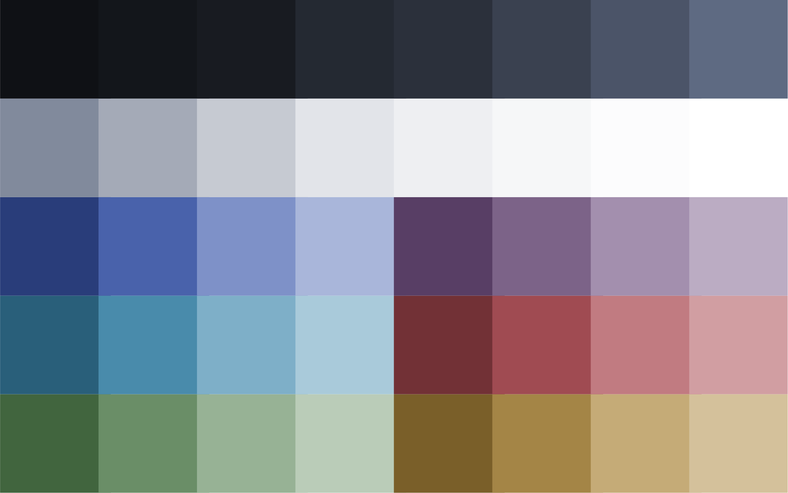

# Sebec Theme

Sebec is a combined light & dark color theme heavily inspired by (and derived from) [Nord](https://www.nordtheme.com/),
with an extended palette that enables a *pleasant light theme* as well as *greater variations in background colors*
for UI elements to enable easier visual separation of panels & widgets and improving focus on 'top' elements.

**Goals**

- Provide a light theme that is consistent with the dark theme and easy to read

- Like Nord, avoid the "rainbow explosion" that some of us find distracting and sometimes even exhausting

- Improve visual separation of UI elements like panels, editors, widget, minimap, etc

    - Avoid a 'flat wash' of background colors or reliance on borders

    - Naturally pull attention to the element that is meant to be focused on

- **Theme-as-code**: Using named colors and generative utilities to enable faster editing,
significantly easier maintenance, and greater consistency across application themes

## Palette

The palette consists of:

- Three 8-color **primary ranges** to enable a greater hierarchy in foreground & background colors

- Four 4-color **accent ranges** (warm & cool greens & blues) that blend well with the 8-color ranges
for visual distinction without significant contrast

- Four 2-color **accent ranges** that visually pop against the others for increased attention grabbing

